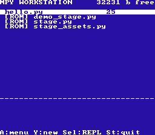
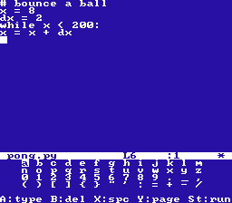
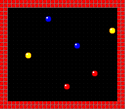
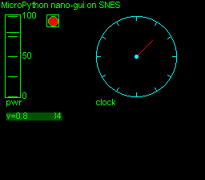

# MicroPython on the Super Nintendo

Real [MicroPython](https://micropython.org) v1.28.0 — lexer, compiler, and
VM — running on a stock SNES: a 3.58 MHz 65816 with a 56 KB Python heap in
console WRAM, built with the [Calypsi 65816](https://www.calypsi.cc/) C
toolchain. Python source is compiled **on the SNES itself**; the port passes
**91.9 % of MicroPython's own `tests/basics` suite** (430 of 468 runnable
tests) on emulated hardware.

| | |
|---|---|
|  |  |
|  |  |

## The ROMs

Prebuilt images are in [`roms/`](roms/); they run in any reasonably accurate
emulator (developed against Mesen2, also tested in snes9x).

- **`mpyos.sfc`** — the "workstation": boots into a C file manager over 32 KB
  battery-backed cartridge SRAM (files survive power-off as the emulator's
  `.srm`), with a full-screen C editor you type into via an on-screen
  keyboard, a Python REPL, and the bundled Stage sprite demo. Each program
  runs in a fresh interpreter.
- **`mpyrepl.sfc`** — standalone interactive REPL on a 32×28 text console.
  Python is lexed, compiled, and executed on the 65816.
- **`mpystage.sfc`** — a port of the [Stage](https://github.com/python-ugame/micropython-stage)
  game library mapped onto the real PPU: tile banks in VRAM shared by BG and
  OBJ, grids as hardware tilemaps, sprites as OAM entries, one-vblank DMA
  flips. Six bouncing sprites driven by pure Python game logic.
- **`mpygui.sfc`** — [nano-gui](https://github.com/peterhinch/micropython-nano-gui)
  widgets rendering through a `framebuf`-backed driver to the PPU.

Controls (workstation): D-pad moves, **A** opens the action menu
(Run/Edit/Delete), **Y** creates a new file, **Select** drops to the REPL,
**Start** quits. On-screen keyboard: **A** types, **B** backspaces, **X**
space, **Start** newline, **Y** switches glyph page, **Select** opens the
editor menu / leaves the REPL.

## Building

```sh
git clone --recurse-submodules <this repo>
cd micropython-sne
tools/fetch_toolchain.sh     # Calypsi 65816 5.17 (note: personal/hobby-use license)
make patch-micropython       # apply patches/ to the submodule (idempotent)
make mpyos mpyrepl mpystage mpygui
```

ROMs land in `build/*.sfc`. The `micropython/` submodule is pinned to
upstream v1.28.0; every change to it lives in
`patches/0001-compiler-workarounds.patch`.

## Testing

Everything is verified headless in [Mesen2](https://www.mesen.ca) through a
WRAM mailbox protocol (`snes/mailbox.c` + `tests/mailbox_harness.lua.in`):
the host feeds scripted stdin/joypad input, the ROM writes its transcript and
exit status into WRAM, pytest asserts both.

```sh
MESEN_PATH=~/bin/Mesen python3 -m pytest tests/   # full ROM suite
python3 tools/run_upstream_tests.py               # MicroPython tests/basics on the SNES
```

## Why this was hard (the fun part)

Bringing a 16-bit `size_t` port up on a niche compiler surfaced **23
root-caused Calypsi code-generation bugs** and **4 upstream MicroPython
bugs** (16-bit truncation and GC-root issues invisible on 32-bit targets).
The headline one: the compiler silently ignores
`__attribute__((aligned))` on struct members and types, so with MicroPython's
`REPR_B` object encoding any ROM object that happened to land on an odd
address was decoded as a small integer — months of "layout-sensitive
miscompiles" from one missing `.align 2`. The VM is also split into per-opcode
handler functions (`port/vm_split.c`) because the original giant
switch-in-a-setjmp-function tripped multiple compiler bugs at once.

- **[`DECISIONS.md`](DECISIONS.md)** — the full engineering log: every bug,
  its reproducer, and the workaround/fence that keeps it from coming back
  (`tools/check_obj_align.py`, `tools/check_neg_index.py` run on every link).
- **[`docs/SESSION_CHRONICLE.md`](docs/SESSION_CHRONICLE.md)** — the
  milestone-by-milestone story, M0 (hello world) to M9 (the workstation).
- **[`bugs/`](bugs/)** — standalone minimal C reproducers for the nastiest
  compiler bugs.

## Layout

| Path | What |
|---|---|
| `port/` | The MicroPython port: `mpconfigport.h`, split VM, `_snesfb`/`_snesstage` C modules, ROM mains |
| `port/pylib/` | Frozen Python libraries (Stage port, nano-gui) |
| `snes/` | Bare-metal layer: text console, mailbox, on-screen keyboard, SRAM filesystem, file manager, editor, cart headers, linker script |
| `micropython/` | Upstream submodule, pinned v1.28.0 |
| `patches/` | All upstream edits, applied by `make patch-micropython` |
| `tests/` | pytest + Mesen2 Lua harness |
| `tools/` | Toolchain fetch, ROM packer, alignment/codegen fences, upstream-suite runner |
| `bugs/` | Minimal Calypsi bug reproducers |
| `m0_hello/`, `m1_selftest/`, `m9_sramtest/` | C-only bring-up/self-test ROMs |
| `roms/` | Prebuilt ROM images |

## Licenses

This port is MIT (see [`LICENSE`](LICENSE)). MicroPython is MIT. The vendored
[Stage](port/pylib/STAGE_LICENSE) and
[nano-gui](port/pylib/NANOGUI_LICENSE) libraries are MIT. The console font is
derived from the public-domain `font8x8`. The Calypsi toolchain itself is
**not** included — `tools/fetch_toolchain.sh` downloads it and its
personal/hobby-use license applies.
